# 3D Object Detection

## Compute Lidar Point-Cloud from Range Image

### Visualize range image channels

Reading and checking the data is usually the first step for any data processing. In this task the range and intensity
of Lidar data is extracted and converted into 2D image.

The requirement for cropping was not stated clearly in the steps. Thus, I assume we would like to make the visualization smaller and more intuitive, and simply dropped the data in backwards direction.

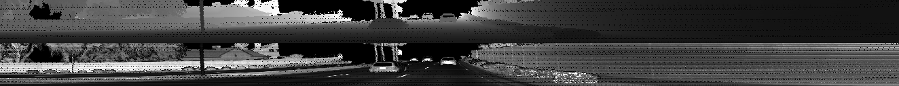

The range and intensity are scaled into range [0,1] (for visualization it is re-scaled into [0,255]).
As the intensity can have very extreme values, compared to the majority of the points, the points with intensity below 1-percentile and above 99-percentile
are set as minimum and maximum.

More examples are available in docs_mid_term/img_range_intensity_*.png.

### Visualize point-cloud

This task is about visualization of 3D point cloud data.

Some interesting features of vehicles (passenger cars, not including vans, trucks and buses) are:

- on shape, it is wider in the middle and smaller on the top
- there are mutiple slops from the middle to the top
- the bottom is empty, except the wheels
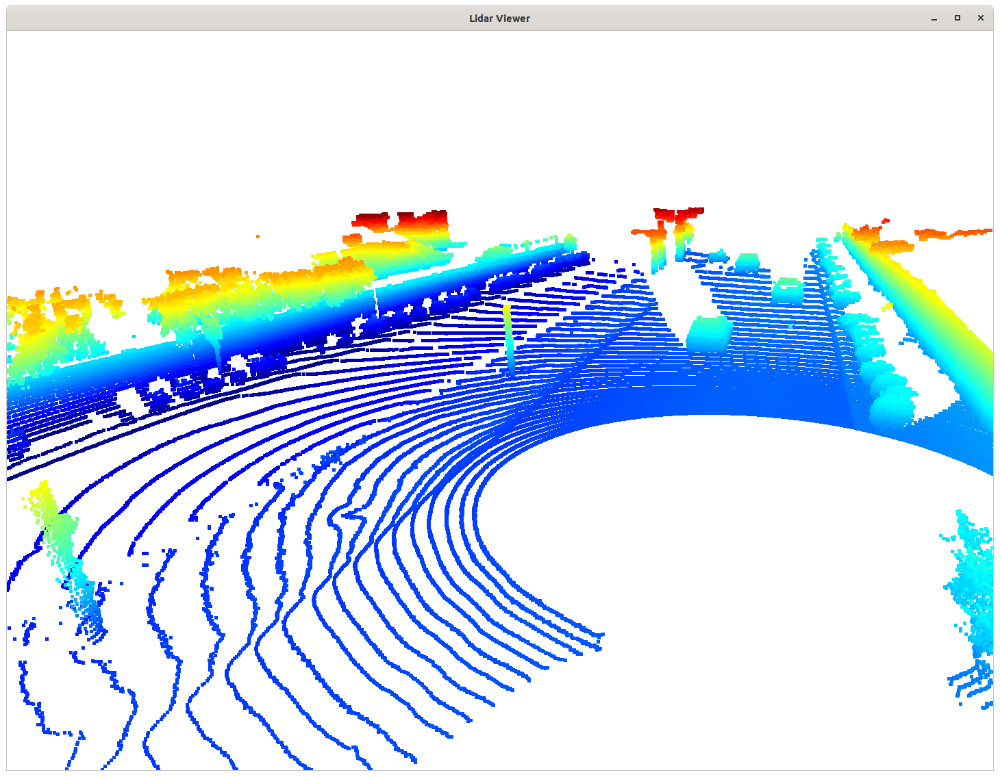
- often there is empty space on the glasses
- there are small rear mirrors
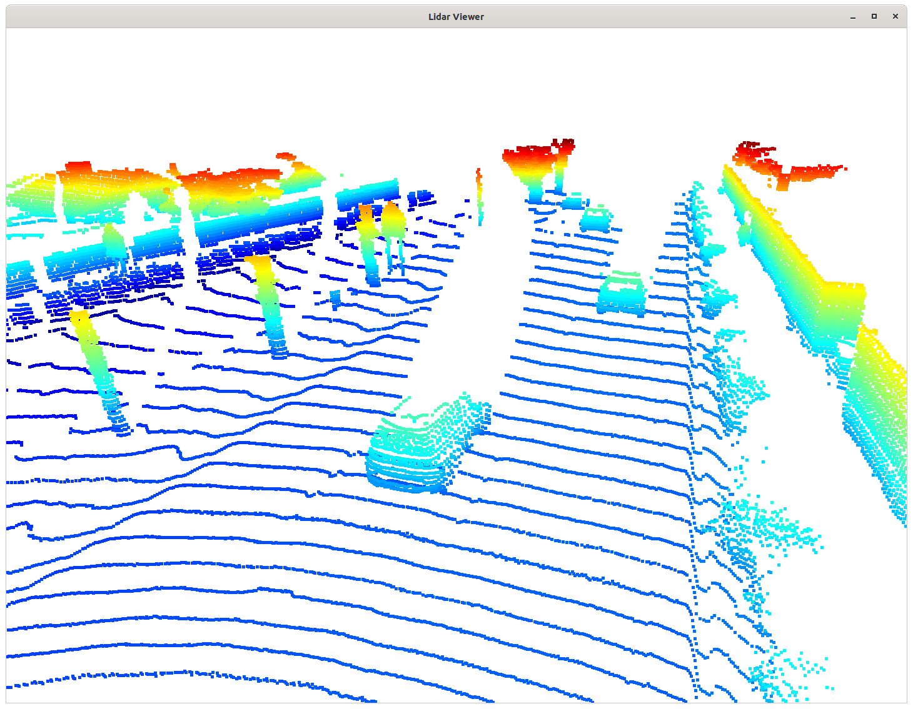
- the shape of wheels is clear
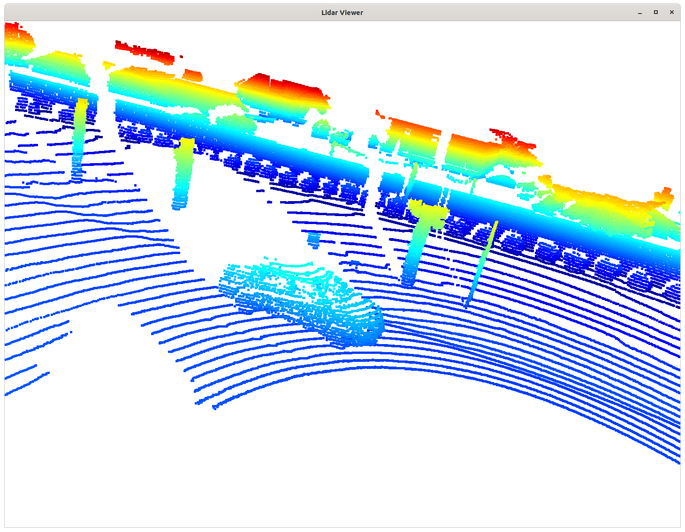
- the front part of the vehicle is very curvy
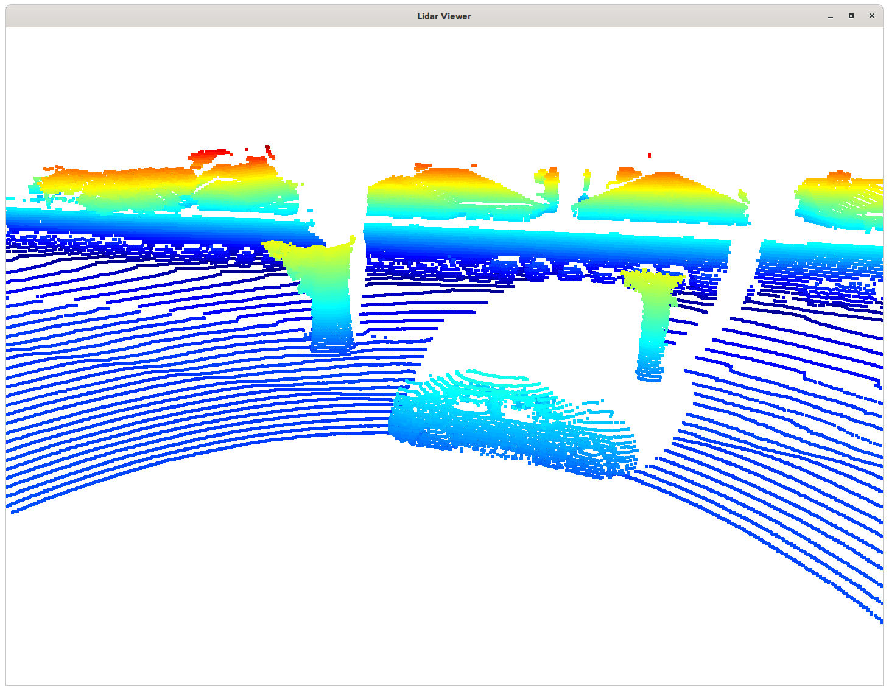
- the rear part of the vehicle relatively flat, but has some curve
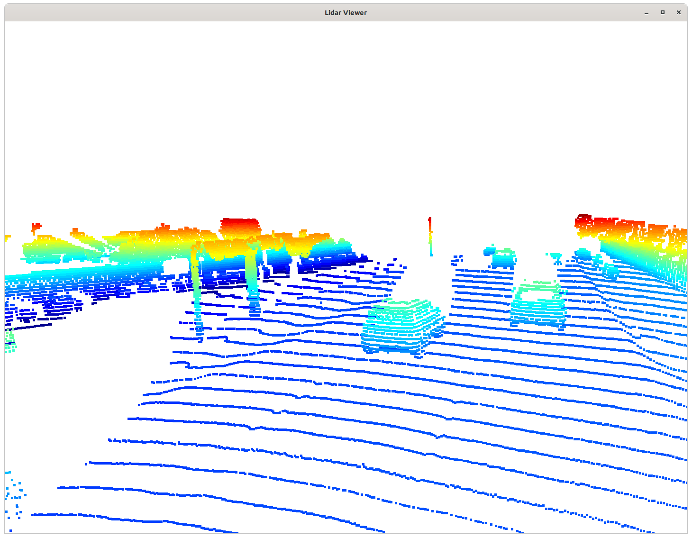
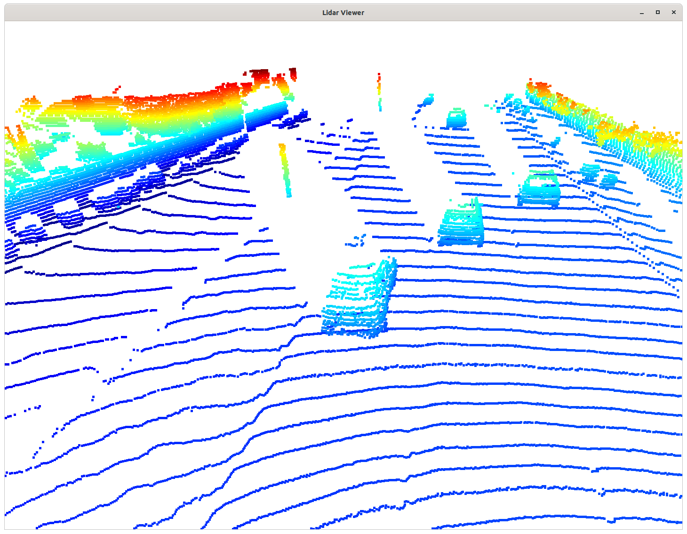

## Create Birds-Eye View from Lidar PCL

This step converts the 3D point cloud into 2D image-like feature map for machine learning models.

### Compute intensity layer of bev-map

The intensity of the top-most point in the grid is used as the value of the pixel. The intensity is normalized as in range-image.
For visualization, the intensity layer is re-scaled into [0,255] in image.

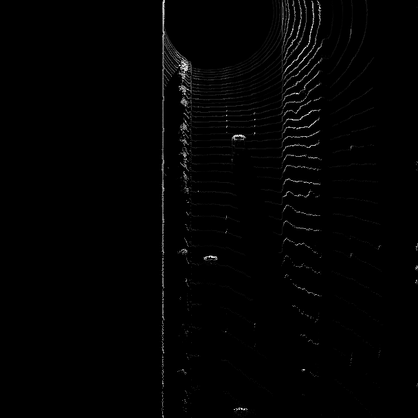

### Compute height layer of bev-map

The largest height of points in one grid is set as the value of the pixel. The height is linearly normalized into [0,1].
For visualization, the height layer is re-scaled into [0,255] in image.

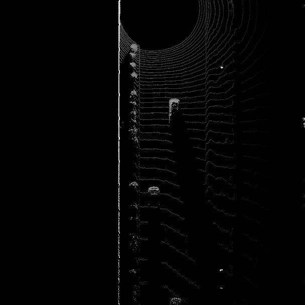

## Model-based Object Detection in BEV Image

This step bridges the BEV image and output bounding box, with *fpn_resnet* based detector.

### Extract 3D bounding boxes from model response

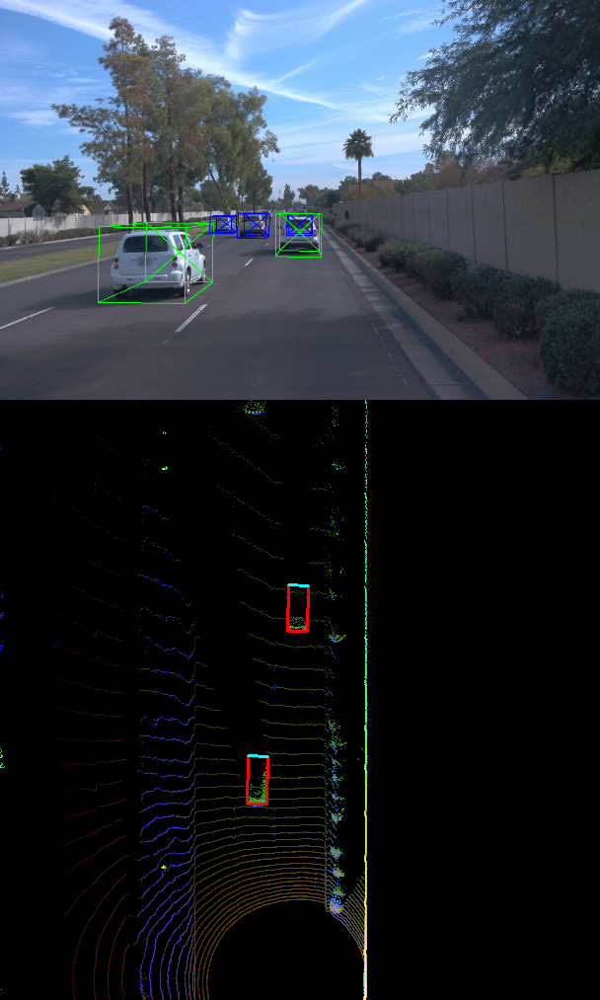

## Performance Evaluation for Object Detection

This step compares the detected result with the labeled ground truth data, and computes the KPI of the detector.

### Compute precision and recall

The computed result of frames [50,150] in the first record is

| KPI | Value |
| ----------- | ----------- |
| precision | 0.9580152671755725 |
| recall | 0.1792857142857143 |

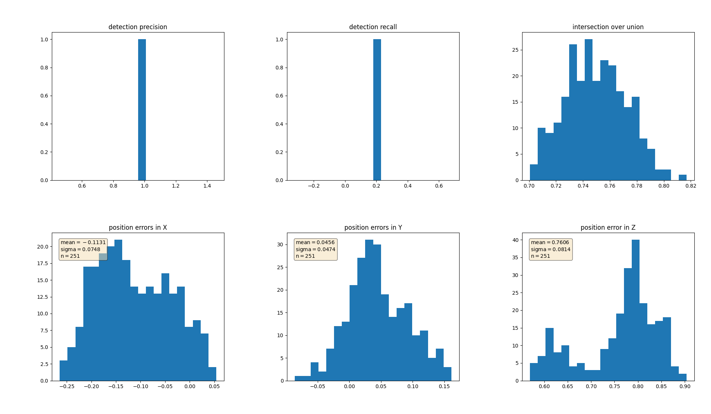

The result has similar but slightly different distribution as in the instruction. Possible reason for the difference can be
the way of normalization in *intensity* and *height*, and technical details of space discretizing such as float->int.
For some reasons, the *density_map* in the original code has "+1" in image size, which should not be necessary.

This step was finished with *fpn_resnet* instead of *darknet*. The implementation with the *darknet* has produced very deviated
result and a fix was not successful.
