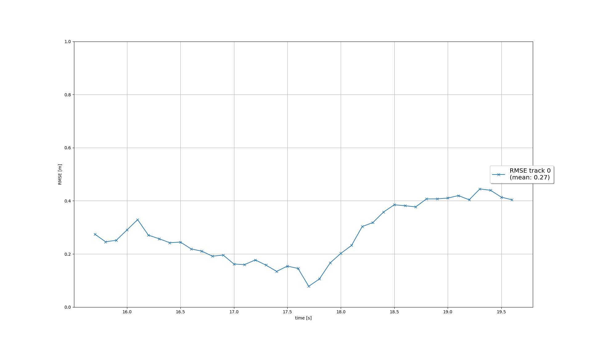
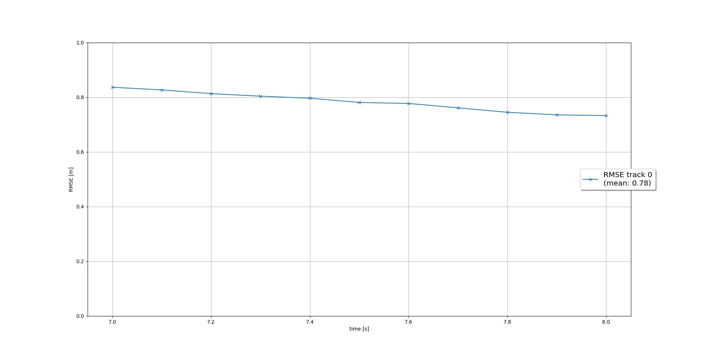
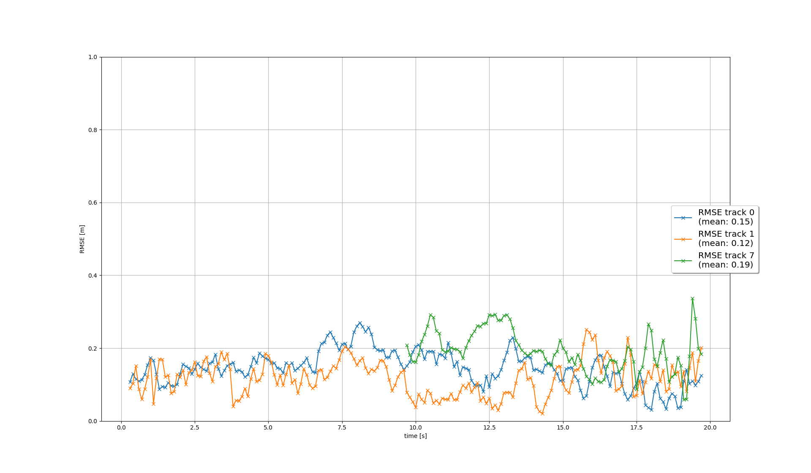
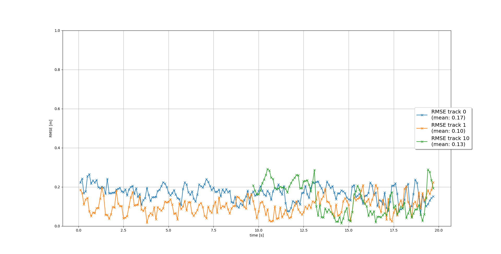

# Writeup: Track 3D-Objects Over Time

Please use this starter template to answer the following questions:

### 1. Write a short recap of the four tracking steps and what you implemented there (filter, track management, association, camera fusion). Which results did you achieve? Which part of the project was most difficult for y

### filter

The EKF consists of system prediction and measurement. I used a single point model for the object
motion, each object has 6 DoF: x, y, z, x', y', z'. The acceleration and rotation are not considered.

The system matrix shows the change of property after time interval dt:

$(position = position + dt * speed)$

$(speed = speed)$

I re-deduced the noise covariance matrix in lecture, corrected the error, and extended in 3D. Then finished predict() with system matrix and process noise covariance matrix.

I extended the excercise code in 2D into update(), gamma() and S(), and replaced some variables in
excercise code with the sensor functions, such as get_hx.

The error in EKF filter.

### track management

A track was initialized with the measurement position in vehicle coordinate system, preassumed
covariance in speed and measured covariance in position.

At each step, the unassociated tracks get a constant penault in score. If a track has high variance or low score, it will be deleted. At first I missed the instruction to delete confirmed tracks, and
and focused on removing $tentative$ tracks, but then the tracks are often removed very fast, always
one step after it turned from $initialized$ to $tentative$.

For each associated track, the score got higher by a constant amount.

### association

MHD is the key for writing association matrix. H is part of sensor property, gamma and S are already
written in the first step. I put unnecessary effort in trying to reimplement S and gamma.

Then I built the association matrix by computing the distance in each pair of track-vs-measuremnet.
Then if the distance fails the probabilitic gating, the distance is changed to inf.

Then the match of track and measurement with the lowest distance was selected in each iteration.
Then the lists of unassigned and the association matrix were updated by removing the associated pair.

I had problem as there was no track throughout the process, as I skipped the whole associate()
when either track_list or meas_list is empty, then the first track was never created from unassigned_meas.

### camera fusion

The in-fov check was done by moving the expected position in sensor coordinate systen and comparing
with the fov. In sensor frame, only the objects in front of the sensor can be seen (velodyne not
fov needs totally different method).

The measurement matrix of camera was written pin-hole model.

Then the observation z and initial noise are added into the measurement. Then the measurement was added in list, also when the device type is camera.

The RMSE for the whole system is as below.

### 2. Do you see any benefits in camera-lidar fusion compared to lidar-only tracking (in theory and in your concrete results)?

In theory the fused data from camera and lidar is better than just lidar data, in perfect settings. The camera image has higher
spatial resolution and thus provides more detailed information, such as classification. In large distance the camera performs also better
than the lidar, because of low point density.

However, both devices must be very accurately calibrated, otherwise the deviation between sensors and the distortion of camera data
can lead to lower accuracy and stability.

In this project the benefit of adding camera in measurement was not obvious.

### 3. Which challenges will a sensor fusion system face in real-life scenarios? Did you see any of these challenges in the project?

One challenge is the wrong detection. Most modern measurements are detected with machine learning based methods, thus the result is
stochastic. Missing measurements are common. This phenomena is often observed in this project. Then the fusion must track correctly when
there are two or three false negatives.

Occlussion is also one major issue. Human can recongize one corner of car behind another, but the sensor tends to miss such targets. In this
project, the cars in front of other cars are seldom detected. But they can be crucial in further control.

### 4. Can you think of ways to improve your tracking results in the future?

In my implementation, the prediction of object seems to be wrong, but the reason was not found. The correction will help a lot.

Parameter tuning for track management can also be improved, especially for the threshold of deletion.

Association with global minima will also improve the stability of the tracks. As when one measurement is wrongly created because of local
minimal distance, new tracks will be created where measurements are densely found.

The classifcation can also be introduced into the track management.

## How to run the code

### 1. build docker

docker build -t fusion-dev -f Dockerfile --build-arg UID=$(id -u) --build-arg GID=$(id -g) --build-arg UNAME=$(whoami) .

### 2. run docker

./run_docker.sh

### 3. prepare data

download pkl in results and the tfrecords in dataset

### 4. run

cd /app/project

python3 loop_over_dataset.py

## The video is compressed in docs/my_tracking_results.zip
